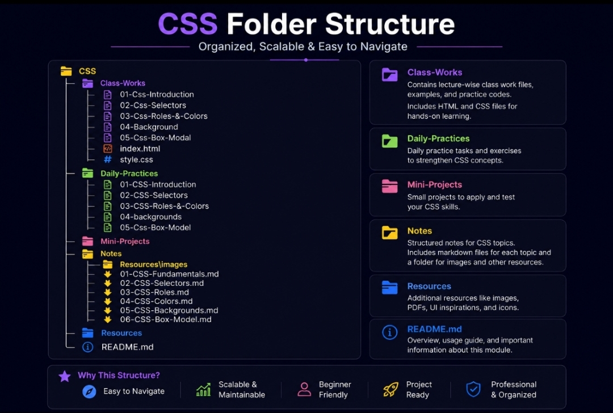

# 📘 Day 01 - CSS Fundamentals

Learn the basics of CSS, including syntax, types of CSS, common properties, and best practices for styling modern web pages.

---

# 📚 Topics

- What is CSS?
- Why Do We Use CSS?
- CSS Syntax
- CSS Types
- Inline CSS
- Internal CSS
- External CSS
- Common CSS Properties
- Color
- Font Size
- Text Align
- Background Color
- Border
- RGB Colors
- Linking External CSS
- CSS Priority
- Common Mistakes
- Real World Usage
- Practice Activities
- CSS Folder Structure

---

# 📖 What is CSS?

**CSS (Cascading Style Sheets)** is used to style and design web pages.

It controls the appearance of HTML elements such as colors, fonts, spacing, borders, layouts, and responsive designs.

---

# ❓ Why Do We Use CSS?

CSS helps developers:

- Change text colors
- Change font sizes
- Add background colors
- Add borders
- Create page layouts
- Build responsive websites
- Improve website appearance

---

# 💻 CSS Syntax

## Syntax

```css
selector{
    property:value;
}
```

## Example

```css
h1{
    color:red;
}
```

## Explanation

| Part | Description |
|------|-------------|
| Selector | Selects the HTML element |
| Property | Defines what to change |
| Value | Specifies the new style |
| Declaration Block | Contains all CSS declarations inside `{}` |

---

# 🎯 Types of CSS

CSS can be applied in three different ways.

---

# 1️⃣ Inline CSS

Inline CSS is written directly inside an HTML element.

## Example

```html
<h1 style="color:blue;">
    Inline CSS
</h1>
```

### ✅ Advantages

- Quick styling
- Easy testing

### ❌ Disadvantages

- Difficult to maintain
- Not reusable

---

# 2️⃣ Internal CSS

Internal CSS is written inside the `<style>` tag.

## Example

```html
<style>

h1{
    color:red;
}

</style>
```

### ✅ Advantages

- Suitable for single-page websites
- Easy for small projects

### ❌ Disadvantages

- Cannot be reused
- Difficult to manage in large projects

---

# 3️⃣ External CSS

External CSS is written in a separate CSS file.

## HTML

```html
<link rel="stylesheet" href="styles.css">
```

## CSS

```css
h1{
    color:red;
}
```

### ✅ Advantages

- Reusable
- Professional approach
- Cleaner code
- Easy maintenance

### ❌ Disadvantages

- Requires an additional CSS file

---

# 🎨 Common CSS Properties

## 🎨 Color

Changes the text color.

```css
color:red;
```

---

## 🔠 Font Size

Changes the size of text.

```css
font-size:30px;
```

---

## 📄 Text Align

Aligns text.

```css
text-align:center;
```

### Common Values

- left
- center
- right
- justify

---

## 🖌️ Background Color

Changes the background color.

```css
background-color:yellow;
```

---

## 🟦 Border

Adds a border around an element.

### Syntax

```css
border:width style color;
```

### Example

```css
border:1px solid black;
```

---

## 🌈 RGB Colors

CSS supports RGB colors.

### Syntax

```css
color:rgb(106,106,204);
```

### Structure

```text
rgb(red, green, blue)
```

### Range

- 0 to 255

---

# 🔗 Linking External CSS

```html
<link rel="stylesheet" href="styles.css">
```

## rel Attribute

```html
rel="stylesheet"
```

The `rel` attribute defines the relationship between the HTML file and the CSS file.

---

# ⚡ CSS Priority

When multiple CSS types are used together, CSS follows this priority:

1. Inline CSS
2. Internal CSS
3. External CSS

Higher-priority styles override lower-priority styles.

---

# ⚠️ Important Notes

- CSS stands for Cascading Style Sheets.
- External CSS is recommended for real-world projects.
- Every declaration should end with a semicolon (`;`).
- CSS separates design from HTML structure.
- CSS makes websites attractive and maintainable.

---

# ❌ Common Mistakes

- Forgetting semicolons
- Missing curly braces
- Incorrect file paths
- Using invalid property names
- Typing mistakes in selectors

---

# 🌍 Real World Usage

CSS is widely used in:

- Portfolio Websites
- Landing Pages
- Blogs
- Business Websites
- Admin Dashboards
- E-commerce Websites

---

# 💻 Practice Activities

- Change text colors
- Apply different font sizes
- Add borders
- Change background colors
- Link an external CSS file
- Practice all three CSS types

---

# 📂 CSS Folder Structure



The above image shows the recommended folder structure for organizing CSS learning resources and project files.
