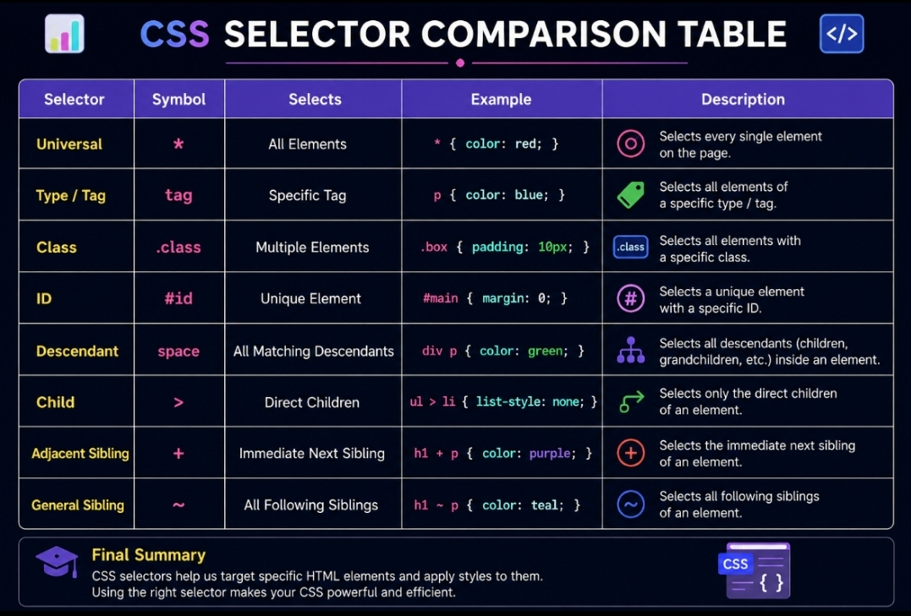

# 🎯 Day 02 - CSS Selectors

Learn how CSS Selectors target HTML elements to apply styles accurately and efficiently. Selectors are the foundation of every CSS rule and are essential for building professional web interfaces.

---

# 📚 Topics

- What are CSS Selectors?
- Universal Selector
- Type Selector
- Class Selector
- ID Selector
- Descendant Selector
- Child Selector
- Adjacent Sibling Selector
- General Sibling Selector
- CSS Selector Comparison
- Final Summary

---

# 📖 What are CSS Selectors?

**CSS Selectors** are patterns used to target HTML elements so that styles can be applied accurately and efficiently.
Every CSS rule begins with a selector, making selectors one of the most important concepts in CSS.

---

# 🌍 Universal Selector

The **Universal Selector** selects every HTML element on the page.

## Syntax

```css
* {
  property: value;
}
```

## Example

```css
* {
  color: blue;
}
```

### ⚡ Important Notes

- Uses the `*` symbol.
- Applies styles to every HTML element.
- Commonly used for resetting margin and padding.

### ❌ Common Mistakes

- Applying too many global styles.
- Accidentally overriding more specific styles.

### 📝 Summary

The Universal Selector affects every HTML element.

---

# 🏷️ Type Selector

The **Type Selector** selects elements based on their HTML tag name.

## Syntax

```css
tag-name {
  property: value;
}
```

## Example

```css
p {
  color: red;
}
```

### ⚡ Important Notes

- Targets all elements of the same HTML tag.
- Simple and widely used.

### ❌ Common Mistakes

- Forgetting that every matching tag will receive the same style.

### 📝 Summary

Type Selectors target HTML elements by their tag names.

---

# 🎨 Class Selector

The **Class Selector** selects elements using the `class` attribute.

## Syntax

```css
.class-name {
  property: value;
}
```

## Example

```css
.highlight {
  color: green;
}
```

### ⚡ Important Notes

- Starts with a dot (`.`).
- Reusable on multiple elements.
- Most commonly used selector in CSS.

### ❌ Common Mistakes

- Forgetting the dot (`.`) before the class name.

### 📝 Summary

Class Selectors provide reusable styling for multiple elements.

---

# 🆔 ID Selector

The **ID Selector** selects one unique HTML element.

## Syntax

```css
#id-name {
  property: value;
}
```

## Example

```css
#header {
  color: blue;
}
```

### ⚡ Important Notes

- Starts with the `#` symbol.
- Should only be used once per page.
- Has higher specificity than a Class Selector.

### ❌ Common Mistakes

- Using the same ID on multiple elements.

### 📝 Summary

ID Selectors target one unique HTML element.

---

# 🌳 Descendant Selector

The **Descendant Selector** selects all matching elements inside a parent element.

## Syntax

```css
parent child {
  property: value;
}
```

## Example

```css
.container p {
  color: blue;
}
```

### ⚡ Important Notes

- Selects children and nested descendants.
- Frequently used in layouts.

### ❌ Common Mistakes

- Confusing it with the Child Selector.

### 📝 Summary

Descendant Selectors target all matching elements inside a parent.

---

# 👨‍👩‍👧 Child Selector

The **Child Selector** selects only direct child elements.

## Syntax

```css
parent > child {
  property: value;
}
```

## Example

```css
.container > p {
  color: red;
}
```

### ⚡ Important Notes

- Uses the `>` symbol.
- Only selects direct children.

### ❌ Common Mistakes

- Expecting nested elements to be selected.

### 📝 Summary

Child Selectors only target direct child elements.

---

# ➕ Adjacent Sibling Selector

The **Adjacent Sibling Selector** selects the immediate next sibling.

## Syntax

```css
element1 + element2 {
  property: value;
}
```

## Example

```css
h2 + p {
  color: green;
}
```

## Real World Example

```css
label + input {
  border: 2px solid green;
}
```

### ⚡ Important Notes

- Selects only one immediate sibling.
- The second element must come directly after the first.

### ❌ Common Mistakes

- Expecting all siblings to be selected.

### 📝 Summary

Adjacent Sibling Selectors target only the immediate next sibling.

---

# 🚀 General Sibling Selector

The **General Sibling Selector** selects all matching siblings that appear after the first element.

## Syntax

```css
element1 ~ element2 {
  property: value;
}
```

## Example

```css
h2 ~ p {
  color: purple;
}
```

### ⚡ Important Notes

- Selects all following matching siblings.
- Both elements must have the same parent.

### ❌ Common Mistakes

- Confusing it with the Adjacent Sibling Selector.

### 📝 Summary

General Sibling Selectors target all following matching siblings.

---

# 🖼️ CSS Selector Comparison



The above image provides a visual comparison of the major CSS selectors, their symbols, and how they target HTML elements.

---

# 🎓 Final Summary

In this lesson, you learned:

- ✅ Universal Selector

- ✅ Type Selector

- ✅ Class Selector

- ✅ ID Selector

- ✅ Descendant Selector

- ✅ Child Selector

- ✅ Adjacent Sibling Selector

- ✅ General Sibling Selector

CSS Selectors are the foundation of CSS. Mastering selectors makes it easier to build layouts, create responsive designs, and write clean, maintainable stylesheets.


