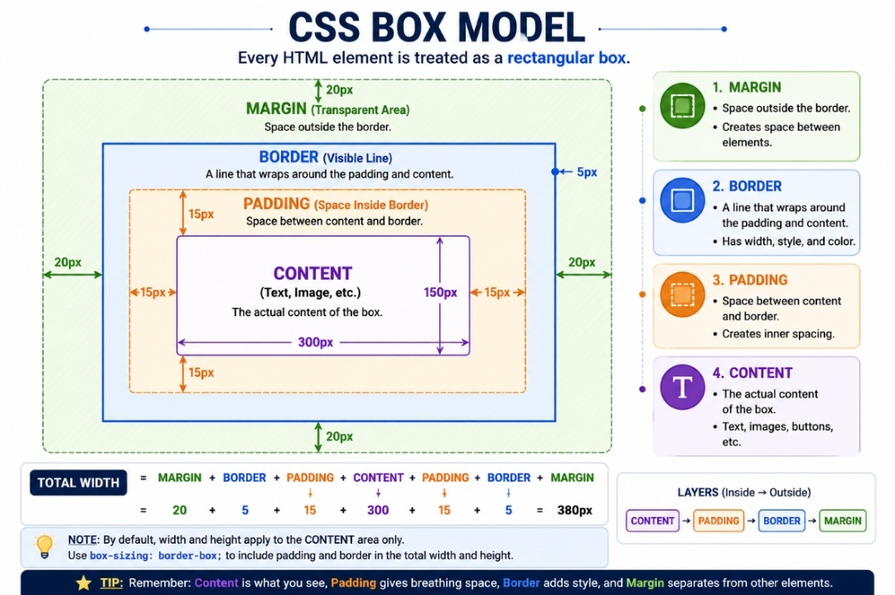

# 📘Day 05 - CSS Box Model 

The **CSS Box Model** is one of the most important concepts in CSS. Every HTML element is displayed as a rectangular box, which helps developers control spacing, borders, and layouts.

---

# 📌 What is CSS Box Model?

The **CSS Box Model** describes how every HTML element is treated as a rectangular box.

It consists of four main parts:

- Content
- Padding
- Border
- Margin

---

# ❓ Why Do We Use Box Model?

The CSS Box Model helps developers:

- Control spacing
- Create layouts
- Add borders
- Adjust element size
- Design cards and sections

---

# 📌 Parts of the CSS Box Model

## 1️⃣ Content

The **Content** is the actual text, image, or other information displayed inside an HTML element.

## 2️⃣ Padding

**Padding** is the space between the content and the border.

## 3️⃣ Border

The **Border** is the line that surrounds the content and padding.

## 4️⃣ Margin

**Margin** is the space outside the border that separates an element from other elements.

---

# 💻 Example

```css
div {
  width: 200px;
  padding: 20px;
  border: 2px solid blue;
  margin: 30px;
}
```

---

# 🔍 Explanation

- **width** → Defines the content width.
- **padding** → Creates space inside the border.
- **border** → Adds a border around the element.
- **margin** → Creates space outside the border.

---

# 📝 Width and Height

The `width` and `height` properties define the size of an HTML element.

## Example

```css
div {
  width: 250px;
  height: 150px;
}
```

- **Width** controls the horizontal size.
- **Height** controls the vertical size.

---

# 📝 Border Properties

The `border` property is used to create a border around an element.

## Example

```css
border: 2px solid blue;
```

### Components

- Border Width
- Border Style
- Border Color

---

# 📝 Padding Properties

The `padding` property creates space between the content and the border.

## Example

```css
padding: 20px;
```

### Individual Properties

- padding-top
- padding-right
- padding-bottom
- padding-left

---

# 📝 Margin Properties

The `margin` property creates space outside the border.

## Example

```css
margin: 20px;
```

### Individual Properties

- margin-top
- margin-right
- margin-bottom
- margin-left

---

# 📝 Border Radius

The `border-radius` property creates rounded corners.

## Example

```css
border-radius: 20px;
```

Used to create rounded corners.

---

# 📝 box-sizing Property

The `box-sizing` property controls how an element's width and height are calculated.

## Example

```css
box-sizing: border-box;
```

This includes padding and border inside the width and height.

---

# ⚠️ Important Notes

- Every HTML element follows the Box Model.
- Padding creates inner spacing.
- Margin creates outer spacing.
- Border surrounds the content.
- `box-sizing` makes layouts easier.

---

# 🌍 Real World Usage

The CSS Box Model is commonly used in:

- Cards
- Buttons
- Navigation Bars
- Forms
- Dashboards
- Product Cards

---

# 🖼️ CSS Box Model Diagram



This diagram shows the relationship between **Content**, **Padding**, **Border**, and **Margin**.
