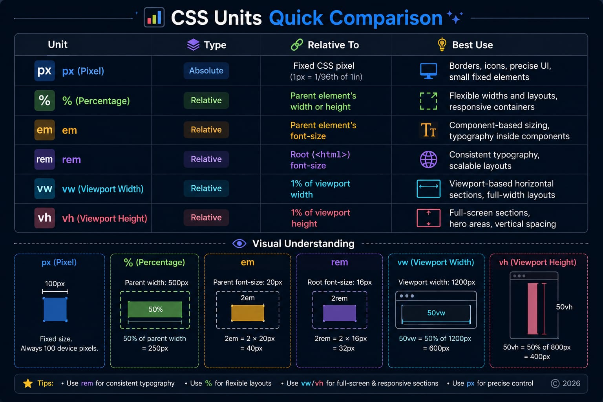

# 📘 Day 07 - CSS Links & Units

This module covers **CSS Links and CSS Units**, two important concepts for creating interactive links, scalable components, and responsive web layouts.

---

## 📚 Topics Covered

### 🔗 CSS Links

- CSS Link States
- `:link`
- `:visited`
- `:hover`
- `:active`
- Default Link Colors
- Correct Link State Order
- Real Use Cases
- Common Mistakes

### 📏 CSS Units

- Absolute Units
- Relative Units
- `px`
- `%`
- `em`
- `rem`
- `vw`
- `vh`
- Real Use Cases
- Effects
- Common Mistakes
- Quick Tips

---

# 🔗 CSS Links

## 📖 Definition

CSS Links are used to style HTML hyperlinks.
CSS provides different pseudo-classes that allow developers to change the appearance of links according to their current state.
These states make links more interactive and provide useful visual feedback to users.
CSS link styling is commonly used in navigation menus, website links, buttons, blogs, and other interactive elements.

---

## 🔄 CSS Link States

CSS links have four main states:

| Link State | Purpose                                              |
| ---------- | ---------------------------------------------------- |
| `:link`    | Styles an unvisited link                             |
| `:visited` | Styles a link that has already been visited          |
| `:hover`   | Styles a link when the mouse pointer is over it      |
| `:active`  | Styles a link while it is being activated or clicked |

---

## 🎨 Default Link Colors

Browsers usually display links with default colors.

| Link State     | Common Default Color |
| -------------- | -------------------- |
| Unvisited Link | Blue                 |
| Visited Link   | Purple               |
| Active Link    | Red                  |

> 💡 Default colors may vary depending on browser styles and user settings.

---

## 🧱 Basic Syntax

```css
a:link {
}

a:visited {
}

a:hover {
}

a:active {
}
```

---

## 📝 HTML Example

```html
<a href="#">Home</a>
```

### CSS

```css
a:link {
  color: blue;
}

a:visited {
  color: purple;
}

a:hover {
  color: red;
}

a:active {
  color: green;
}
```

---

# 1️⃣ `:link`

## 📖 Definition

The `:link` pseudo-class styles an **unvisited hyperlink**.
It represents the normal state of a link before the user has visited its destination.
It is commonly used to define the initial appearance of website links.

### Syntax

```css
a:link {
  color: blue;
}
```

### 🌍 Real Use Cases

- Navigation links
- Blog links
- Footer links
- External website links
- Menu links

---

# 2️⃣ `:visited`

## 📖 Definition

The `:visited` pseudo-class styles a link whose destination has already been visited.
It helps users recognize pages or resources they have previously opened.

### Syntax

```css
a:visited {
  color: purple;
}
```

### 🌍 Real Use Cases

- Blog article lists
- Documentation links
- Search results
- Resource pages
- News websites

---

# 3️⃣ `:hover`

## 📖 Definition

The `:hover` pseudo-class applies styles when the mouse pointer is placed over an element.
It provides immediate visual feedback and makes interfaces feel more interactive.
Although commonly used with links, `:hover` can also be used with buttons, cards, images, and many other elements.

### Syntax

```css
a:hover {
  color: red;
}
```

### 🌍 Real Use Cases

- Navigation menus
- Buttons
- Cards
- Images
- Dropdown menus
- Interactive links

---

# 4️⃣ `:active`

## 📖 Definition

The `:active` pseudo-class styles an element during its activation.
For links and buttons, it usually applies for the short period while the user is pressing or activating the element.
It provides immediate interaction feedback.

### Syntax

```css
a:active {
  color: green;
}
```

### 🌍 Real Use Cases

- Links
- Buttons
- Navigation items
- Interactive controls

---

## 🔄 Correct Link State Order

Link states should normally be written in the following order:

```text
:link → :visited → :hover → :active
```

A common memory trick is:

> 💡 **LVHA — LoVe HAte**

The correct order helps prevent later pseudo-class rules from unexpectedly overriding earlier link-state styles.

---

## 🌍 Real Use Cases of CSS Links

CSS link states are commonly used for:

- Navigation menus
- Website links
- Blog article links
- Footer navigation
- Call-to-action links
- Documentation pages
- Interactive user interfaces

---

## ⚠️ Common Mistakes — CSS Links

❌ Writing link states in the wrong order.

❌ Forgetting the colon `:` before a pseudo-class.

❌ Confusing `:hover` with `:active`.

❌ Using unclear hover effects that provide poor visual feedback.

❌ Removing useful link indicators without providing another clear visual style.

---

## 💡 Quick Tip

Use link states consistently so users can easily understand which elements are interactive.

---

# 📏 CSS Units

## 📖 Definition

CSS Units define the size and dimensions of elements.

They are used to control:

- Width
- Height
- Spacing
- Padding
- Margin
- Font Size
- Borders
- Layout Dimensions

CSS units help developers create both **fixed** and **responsive** layouts.

---

## 📂 Types of CSS Units

CSS units can be divided into two main categories:

### 1️⃣ Absolute Units

Absolute units represent fixed measurements.

Common absolute units include:

- `px`
- `cm`
- `mm`
- `in`
- `pt`
- `pc`

### 2️⃣ Relative Units

Relative units depend on another reference value.

Common relative units include:

- `%`
- `em`
- `rem`
- `vw`
- `vh`

---

## ⭐ Most Commonly Used Units

The following units are commonly used in modern web development:

- `px`
- `%`
- `em`
- `rem`
- `vw`
- `vh`

---

# 📌 Absolute Units

## 📖 Definition

Absolute units represent fixed measurements.
They do not scale directly according to the size of a parent element.
They are useful when controlled or precise sizing is required.

Examples include:

```text
px
cm
mm
in
pt
pc
```

For screen-based web development, `px` is the most commonly used absolute unit.

---

# 1️⃣ `px` — Pixel

## 📖 Definition

A pixel (`px`) is an absolute CSS unit commonly used for precise screen-based measurements.
It is useful when an element needs a controlled size.
Unlike percentage-based sizing, a pixel value does not scale directly according to the parent element's width.

---

## 🧱 Syntax

```css
.box {
  width: 300px;
  height: 150px;
}
```

---

## 🌍 Real Use Cases

`px` is commonly used for:

- Borders
- Icons
- Small fixed elements
- Border radius
- Box shadows
- Precise UI details

---

## 🎯 Effect

```text
Element Width: 300px
```

If the parent element changes size, the declared width remains:

```text
300px
```

unless another CSS rule changes it.

---

## 👀 Visual Understanding

Think of `px` as a fixed ruler.

If a box has:

```css
.box {
  width: 300px;
}
```

its declared width remains `300px` regardless of the parent width.

---

## ⚠️ Common Mistake

❌ Using fixed pixel widths for every part of a full-page layout.
This can make layouts less flexible on different screen sizes.

---

## 💡 Quick Tip

Use `px` for small, precise, and controlled UI details when fixed sizing is appropriate.

---

# 📐 Relative Units

## 📖 Definition

Relative units calculate their values based on another reference value.

The reference may be:

- A containing block
- A parent font size
- The root font size
- The viewport width
- The viewport height

Relative units are widely used for flexible and responsive web design.

---

# 2️⃣ `%` — Percentage

## 📖 Definition

Percentage (`%`) is a relative unit.

Its calculated value depends on the property and its reference context.
For example, percentage widths commonly depend on the width of the containing block.
It is useful for flexible and responsive layouts.

---

## 🧱 Example

```css
.container {
  width: 1000px;
}

.box {
  width: 50%;
}
```

### Result

```text
50% of 1000px = 500px
```

If the container width becomes:

```text
600px
```

the result becomes:

```text
50% of 600px = 300px
```

---

## 🌍 Real Use Cases

Percentage units are commonly used for:

- Containers
- Images
- Responsive widths
- Cards
- Sections
- Flexible layouts

---

## 🎯 Effect

When the relevant containing block becomes smaller, a percentage-based width also becomes smaller.
When it becomes larger, the width increases proportionally.

---

## 📝 HTML Example

```html
<div class="container">
  <div class="box">I'm a Box!</div>
</div>
```

### CSS

```css
.container {
  width: 800px;
}

.box {
  width: 50%;
}
```

### Result

```text
Box Width = 400px
```

---

## ⚠️ Common Mistake

❌ Using percentage height without understanding the containing block's height calculation.
Percentage heights may not behave as expected when the required reference height is not definite.

---

## 💡 Quick Tip

Use percentage widths when an element should scale relative to its containing block.

---

# 3️⃣ `em`

## 📖 Definition

`em` is a relative CSS unit.

For `font-size`, it is calculated relative to the inherited font size of the element.
For many other properties, such as padding and margin, it is based on the element's own computed font size.
It is useful for scalable and reusable components.

---

## 🧱 Example

```css
.parent {
  font-size: 20px;
}

.text {
  font-size: 2em;
}
```

### Result

```text
2 × 20px = 40px
```

---

## 🌍 Real Use Cases

`em` is commonly used for:

- Button padding
- Component font sizes
- Card spacing
- Reusable UI components
- Component-based sizing

---

## 🎯 Effect

If the inherited font size changes, an `em`-based `font-size` changes accordingly.

### Example

```text
Inherited Font Size = 20px
Child Font Size = 2em

Result = 40px
```

---

## 👀 Visual Understanding

```text
Font context changes → em-based sizing changes
```

This makes `em` useful for components that should scale with their typography.

---

## 📝 HTML Example

```html
<div class="parent">
  <p class="text">Hello</p>
</div>
```

### CSS

```css
.parent {
  font-size: 20px;
}

.text {
  font-size: 2em;
}
```

---

## ⚠️ Common Mistake

❌ Deeply nested `em`-based font sizes can compound and become unexpectedly large or small.

---

## 💡 Quick Tip

Use `em` when sizing should scale with a component's font-size context.

---

# 4️⃣ `rem` — Root EM

## 📖 Definition

`rem` stands for **Root EM**.

It is a relative unit based on the font size of the root `<html>` element.
Unlike `em`, it does not compound through parent font-size nesting.
This makes it useful for consistent typography and spacing systems.

---

## 🧱 Example

```css
html {
  font-size: 16px;
}

.heading {
  font-size: 2rem;
}
```

### Result

```text
2 × 16px = 32px
```

---

## 🌍 Real Use Cases

`rem` is commonly used for:

- Headings
- Paragraph text
- Typography systems
- Consistent spacing
- Design systems
- Scalable UI layouts

---

## 🎯 Effect

If the root font size is:

```text
16px
```

then:

```text
1rem = 16px
2rem = 32px
3rem = 48px
```

---

## 💡 Quick Tip

Use `rem` when you want consistent sizing across the website based on the root font size.

---

# 5️⃣ `vw` — Viewport Width

## 📖 Definition

`vw` is a relative CSS unit based on the width of the viewport.

```text
1vw = 1% of the viewport width
```

It changes when the viewport width changes.

---

## 🧱 Example

```css
.hero {
  width: 100vw;
}
```

---

## 🌍 Real Use Cases

`vw` is commonly used for:

- Viewport-based widths
- Hero sections
- Large decorative elements
- Fluid sizing
- Responsive visual elements

---

## 🎯 Effect

If the viewport width is:

```text
1200px
```

then:

```text
1vw = 12px
50vw = 600px
100vw = 1200px
```

---

## ⚠️ Common Mistake

❌ Using `100vw` without considering scrollbars and surrounding layout behavior, which can sometimes cause horizontal overflow.

---

## 💡 Quick Tip

Use `vw` when an element's size should respond directly to the viewport width.

---

# 6️⃣ `vh` — Viewport Height

## 📖 Definition

`vh` is a relative CSS unit based on the height of the viewport.

```text
1vh = 1% of the viewport height
```

It is useful for viewport-height-based sections.

---

## 🧱 Example

```css
.hero {
  min-height: 100vh;
}
```

---

## 🌍 Real Use Cases

`vh` is commonly used for:

- Hero sections
- Landing pages
- Full-screen sections
- Splash screens
- Viewport-height layouts

---

## 🎯 Effect

If the viewport height is:

```text
800px
```

then:

```text
1vh = 8px
50vh = 400px
100vh = 800px
```

---

## ⚠️ Common Mistake

❌ Assuming `100vh` always behaves perfectly on every mobile browser.
Mobile browser interface elements can affect the visible viewport. Modern CSS also provides units such as `dvh`, `svh`, and `lvh` for more specific viewport behavior.

---

## 💡 Quick Tip

Use `vh` for viewport-height-based layouts, but test full-screen sections carefully on mobile devices.

---

# 📊 CSS Units Quick Comparison



---

# 🎯 How to Choose the Right Unit

Use `px` when:

- You need precise UI details
- You need controlled fixed sizing
- You are styling borders or small visual details

Use `%` when:

- Width should scale relative to its container
- You are creating flexible layouts
- Elements need proportional sizing

Use `em` when:

- A component should scale with its typography
- You are creating reusable components
- Spacing should follow component font sizing

Use `rem` when:

- You need consistent typography
- You want a root-based spacing system
- You are building a scalable design system

Use `vw` when:

- Sizing should respond to viewport width
- You need viewport-based horizontal sizing

Use `vh` when:

- A section should respond to viewport height
- You are creating hero or full-screen sections

---

# ⚠️ Common Mistakes Summary

### CSS Links

❌ Writing pseudo-classes in an unsuitable order.

❌ Confusing `:hover` and `:active`.

❌ Forgetting the `:` before pseudo-classes.

❌ Providing weak or unclear interaction feedback.

### CSS Units

❌ Using fixed `px` values for every part of a responsive layout.

❌ Using percentage height without understanding its reference height.

❌ Allowing nested `em` font sizes to compound unexpectedly.

❌ Using viewport units without testing different screen sizes.

❌ Choosing a unit without understanding what it is relative to.

---

# 🧠 Key Learning

Through this module, I learned how to:

- Style HTML links in different interaction states
- Use `:link`, `:visited`, `:hover`, and `:active`
- Follow the recommended order of link states
- Understand absolute and relative CSS units
- Use `px` for precise sizing
- Use `%` for proportional layouts
- Use `em` for component-relative sizing
- Use `rem` for consistent root-relative sizing
- Use `vw` for viewport-width-based sizing
- Use `vh` for viewport-height-based sizing
- Select CSS units according to layout requirements
- Avoid common mistakes when working with links and units


