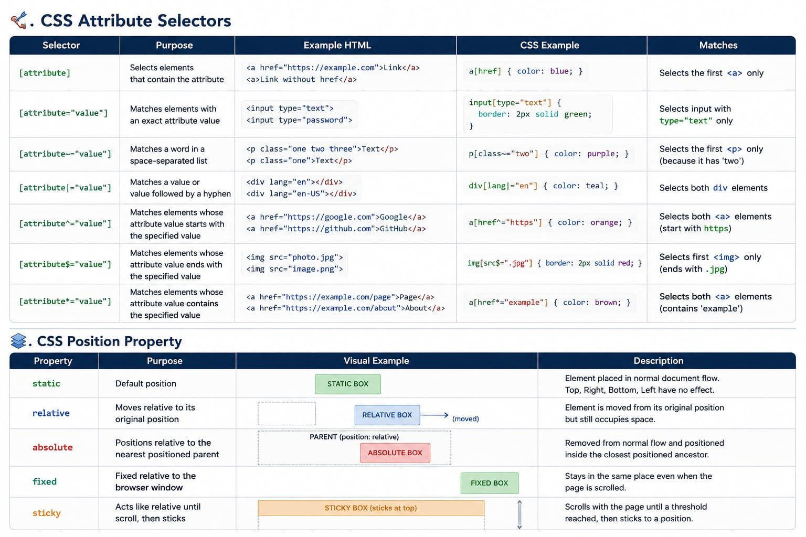

# 📘Day 10 - CSS Attribute Selectors & Positioning 

This module shows how to use **CSS Attribute Selectors** to target HTML elements based on their attributes and understand how the **CSS Position Property** controls the placement of elements on a webpage.

---

## 📖 Definition

### CSS Attribute Selectors

CSS Attribute Selectors allow developers to select HTML elements based on their attributes or attribute values. They help write cleaner, reusable, and more maintainable CSS without adding unnecessary classes or IDs.

### CSS Position Property

The CSS Position Property controls how an element is placed within a webpage. It determines whether an element remains in the normal document flow or can be moved using positioning properties like `top`, `right`, `bottom`, and `left`.

---

## 🎯 Why Do We Use It?

### CSS Attribute Selectors

- Style specific HTML elements.
- Target form inputs efficiently.
- Reduce unnecessary classes.
- Write cleaner CSS.
- Improve code maintainability.

### CSS Position Property

- Create navigation bars.
- Build dropdown menus.
- Design notification badges.
- Create sticky headers.
- Position floating buttons and modals.

---

## 📝 Syntax

### Attribute Selector

```css
selector[attribute] {
  property: value;
}
```

```css
selector[attribute="value"] {
  property: value;
}
```

### Position Property

```css
selector {
  position: value;
}
```

---

## 🔑 Main Properties



---

## 💻 Practical Example

### Attribute Selector

```css
input[required] {
  border: 2px solid green;
}

input[type="password"] {
  border: 2px solid orange;
}
```

### Position Property

```css
.box {
  position: relative;
  top: 20px;
  left: 30px;
}
```

---

## 🌍 Real World Uses

### CSS Attribute Selectors

- Login Forms
- Registration Forms
- Search Bars
- Email Inputs
- External Links

### CSS Position Property

- Sticky Navigation
- Floating Action Button
- Notification Badge
- Dropdown Menu
- Modal Window

---

## 💡 Developer Tips

- Use Attribute Selectors when classes are unnecessary.
- Prefer semantic HTML whenever possible.
- Use `position: relative;` on the parent before using `absolute`.
- Avoid overusing `fixed`.
- Use `sticky` for navigation bars and page headers.

---

## ⚠ Common Mistakes

### Attribute Selectors

- Using incorrect attribute names.
- Confusing `=` with `*=`, `^=`, or `$=`.
- Forgetting quotation marks around attribute values.

### Position Property

- Forgetting to position the parent element.
- Using `absolute` without a positioned parent.
- Overusing `fixed`, causing layout issues.

---

## ⭐ Interview Notes

**Q:** What is a CSS Attribute Selector?

**A:** It selects HTML elements based on their attributes or attribute values.

---

**Q:** What is the default value of the Position property?

**A:** `static`

---

**Q:** Which Position value removes an element from the normal document flow?

**A:** `absolute` and `fixed`

---

**Q:** Which Position value sticks while scrolling?

**A:** `sticky`

---

## ⚡ Quick Revision

### Attribute Selectors

- `[attribute]`

- `[attribute="value"]`

- `[attribute~="value"]`

- `[attribute|="value"]`

- `[attribute^="value"]`

- `[attribute$="value"]`

- `[attribute*="value"]`

### Position Property

- `static`

- `relative`

- `absolute`

- `fixed`

- `sticky`

---

## 📚 Day Summary

After completing this chapter, you should be able to:

- ✅ Use CSS Attribute Selectors effectively.

- ✅ Target HTML elements based on attributes.

- ✅ Understand all Position property values.

- ✅ Build professional layouts using CSS Position.

- ✅ Apply these concepts in real-world projects.


