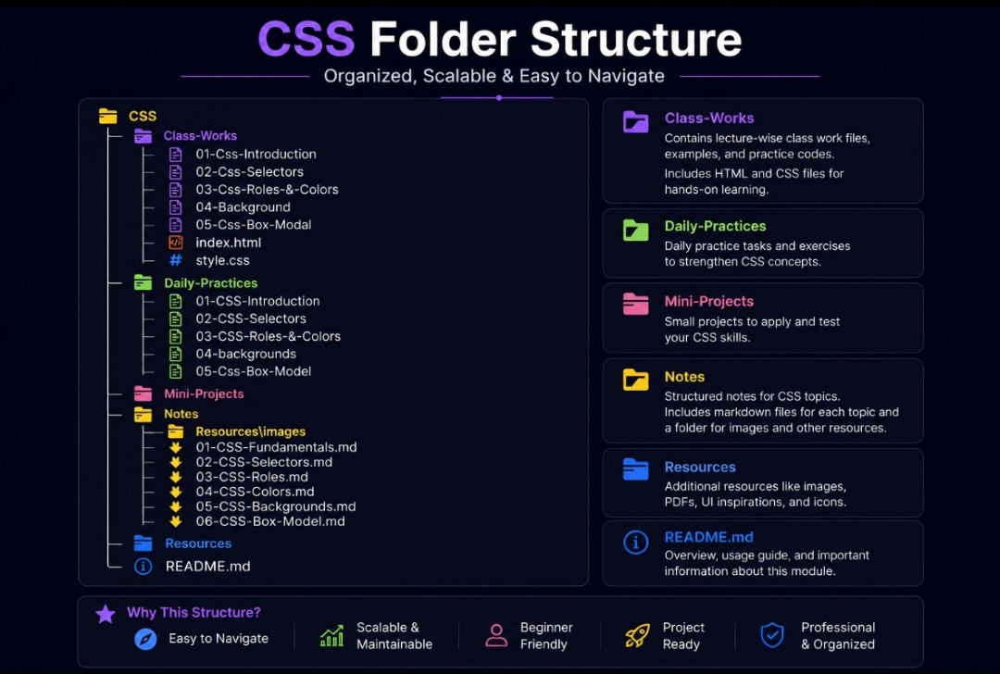

📘 CSS Fundamentals Notes

---

📌 What is CSS?

CSS (Cascading Style Sheets) is used to style and design web pages.

It controls the appearance of HTML elements such as colors, fonts, spacing, borders, and layouts.

---

❓ Why Do We Use CSS?

CSS helps us:

- Change text colors
- Change font sizes
- Add backgrounds
- Add borders
- Create layouts
- Build responsive websites
- Improve website design

---

💻 CSS Syntax

selector {
property: value;

}

---

💻 Example

h1 {
color: red;

}

---

🔍 Explanation

- "h1" → Selector
- "color" → Property
- "red" → Value
- "{}" → Declaration Block

---

📌 Types of CSS

CSS can be applied in three different ways.

---

1️⃣ Inline CSS

Inline CSS is written directly inside an HTML element.

💻 Example

<h1 style="color: blue;">
    Inline CSS
</h1>

✅ Advantages

- Quick styling
- Easy testing

❌ Disadvantages

- Difficult to maintain
- Not reusable

---

2️⃣ Internal CSS

Internal CSS is written inside the "<style>" tag.

💻 Example

<style>
h1 {
    color: red;
}
</style>

✅ Advantages

- Easy for single pages
- Good for small projects

❌ Disadvantages

- Cannot be reused
- Difficult for large websites

---

3️⃣ External CSS

External CSS is written inside a separate CSS file.

💻 HTML File

```html
<link rel="stylesheet" href="styles.css" />
```

💻 CSS File

```css
h1 {
  color: red;
}
```

✅ Advantages

- Reusable
- Professional approach
- Cleaner code
- Easy maintenance

❌ Disadvantages

- Requires an additional file

---

🎨 Common CSS Properties

---

🎨 Color

Changes the text color.

color: red;

---

🔠 Font Size

Changes the size of text.

font-size: 30px;

---

📄 Text Align

Aligns text.

text-align: center;

Possible values:

- left
- center
- right
- justify

---

🖌 Background Color

Changes the background color.

background-color: yellow;

---

🟦 Border

Adds a border around an element.

border: 2px solid red;

Border Structure

border: width style color;

Example:

border: 1px solid black;

---

🌈 RGB Colors

CSS supports RGB colors.

color: rgb(106, 106, 204);

RGB Structure

rgb(red, green, blue)

Range:

- 0 to 255

---

🔗 Linking External CSS

```css
<link rel="stylesheet" href="styles.css">
```

rel Attribute

rel="stylesheet"

This attribute defines the relationship between the HTML file and CSS file.

---

⚡ CSS Priority

When multiple CSS types are used together:

1. Inline CSS
2. Internal CSS
3. External CSS

Higher priority styles override lower priority styles.

---

⚠ Important Notes

- CSS stands for Cascading Style Sheets.
- External CSS is preferred for real projects.
- Every declaration ends with a semicolon.
- CSS makes websites attractive.
- CSS separates design from HTML.

---

❌ Common Mistakes

- Forgetting semicolons.
- Missing curly braces.
- Incorrect file paths.
- Wrong property names.
- Typing mistakes in selectors.

---

🌍 Real World Usage

CSS is used in:

- Portfolio Websites
- Landing Pages
- Blogs
- Admin Panels

---

🚀 Practice Activities

- Change text colors.
- Apply font sizes.
- Add borders.
- Create background colors.
- Link external CSS files.
- Practice all three CSS types.

---

✅ Topics Covered

✔ CSS Introduction
✔ CSS Syntax
✔ Selectors
✔ Inline CSS
✔ Internal CSS
✔ External CSS
✔ Color
✔ RGB Color
✔ Font Size
✔ Text Align
✔ Background Color
✔ Border
✔ Linking CSS File
✔ CSS Priority

---

🗂 CSS Folder Structure



This diagram represents the complete folder organization of the CSS module.
