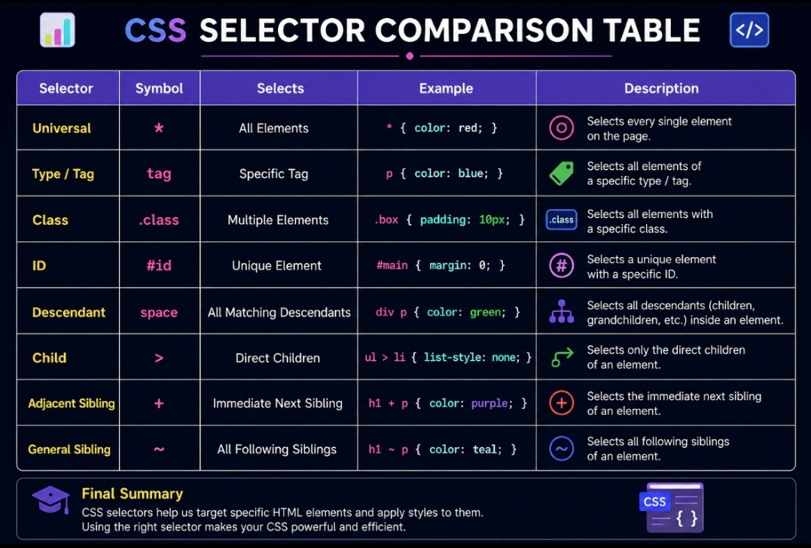

🎯 CSS Selectors Notes

CSS Selectors are patterns used to target HTML elements so that styles can be applied accurately and efficiently.

---

📖 What are CSS Selectors?

CSS Selectors help developers select HTML elements and apply styles to them.
They are one of the most important concepts in CSS because every style rule starts with a selector.

---

🌍 Universal Selector

The Universal Selector selects all HTML elements on a webpage.

🛠 Syntax

- {
  property: value;

  }

💻 Example

- {
  color: blue;

  }

⚡ Important Notes

- Uses the "\*" symbol.
- Applies styles to every element.
- Commonly used for resetting margin and padding.

❌ Common Mistakes

- Applying too many global styles.
- Overriding specific element styles.

📝 Summary

The Universal Selector affects every HTML element.

---

🏷 Type Selector

The Type Selector selects elements based on their HTML tag name.

🛠 Syntax

tag-name {
property: value;

}

💻 Example

p {
color: red;

}

⚡ Important Notes

- Targets all elements of the same tag.
- Simple and widely used.

❌ Common Mistakes

- Forgetting that every matching tag will be affected.

📝 Summary

Type Selectors target elements by their tag names.

---

🎨 Class Selector

The Class Selector selects elements using the class attribute.

🛠 Syntax

.class-name {
property: value;

}

💻 Example

.highlight {
color: green;

}

⚡ Important Notes

- Starts with a dot (".").
- Reusable on multiple elements.
- Most commonly used selector.

❌ Common Mistakes

- Forgetting the dot before the class name.

📝 Summary

Class Selectors provide reusable styling for multiple elements.

---

🆔 ID Selector

The ID Selector selects a unique HTML element using its ID.

🛠 Syntax

#id-name {
property: value;

}

💻 Example

#header {
color: blue;

}

⚡ Important Notes

- Starts with the "#" symbol.
- Should only be used once per page.
- Has higher priority than Class Selectors.

❌ Common Mistakes

- Using the same ID multiple times.

📝 Summary

ID Selectors target a single unique element.

---

🌳 Descendant Selector

The Descendant Selector selects all matching elements inside a parent element.

🛠 Syntax

parent child {
property: value;

}

💻 Example

.container p {
color: blue;

}

⚡ Important Notes

- Selects children and nested descendants.
- Frequently used in layouts.

❌ Common Mistakes

- Confusing it with Child Selector.

📝 Summary

Descendant Selectors target all matching elements inside a parent.

---

👨‍👩‍👧 Child Selector

The Child Selector selects only direct child elements.

🛠 Syntax

parent > child {
property: value;

}

💻 Example

.container > p {
color: red;

}

⚡ Important Notes

- Uses the ">" symbol.
- Only selects direct children.

❌ Common Mistakes

- Expecting nested elements to be selected.

📝 Summary

Child Selectors only target direct child elements.

---

➕ Adjacent Sibling Selector

The Adjacent Sibling Selector selects the immediate next sibling.

🛠 Syntax

element1 + element2 {
property: value;

}

💻 Example

h2 + p {
color: green;

}

🌍 Real World Example

label + input {
border: 2px solid green;

}

⚡ Important Notes

- Selects only one sibling.
- The sibling must come immediately after the first element.

❌ Common Mistakes

- Expecting all siblings to be selected.

📝 Summary

Adjacent Sibling Selectors target the immediate next sibling.

---

🚀 General Sibling Selector

The General Sibling Selector selects all matching siblings that come later.

🛠 Syntax

element1 ~ element2 {
property: value;

}

💻 Example

h2 ~ p {
color: purple;

}

⚡ Important Notes

- Selects all following siblings.
- Both elements must share the same parent.

❌ Common Mistakes

- Confusing it with Adjacent Sibling Selector.

📝 Summary

General Sibling Selectors target all following matching siblings.

---

🖼 CSS Selector Comparison Diagram

This diagram provides a visual comparison of all major CSS selectors, their symbols, and their behavior.

It helps developers quickly understand the difference between Universal, Class, ID, Child, Descendant,Sibling Selectors & General Sibling Selector.

---

🎓 Final Summary

In this module, I learned:

✅ Universal Selector
✅ Type Selector
✅ Class Selector
✅ ID Selector
✅ Descendant Selector
✅ Child Selector
✅ Adjacent Sibling Selector
✅ General Sibling Selector

CSS Selectors are the foundation of styling in CSS. They help developers target elements accurately and build professional user interfaces.

💡 Before moving forward, it is important to master selectors because they are used in:

- CSS Box Model
- Display Properties
- Flexbox
- CSS Grid
- Responsive Web Design
