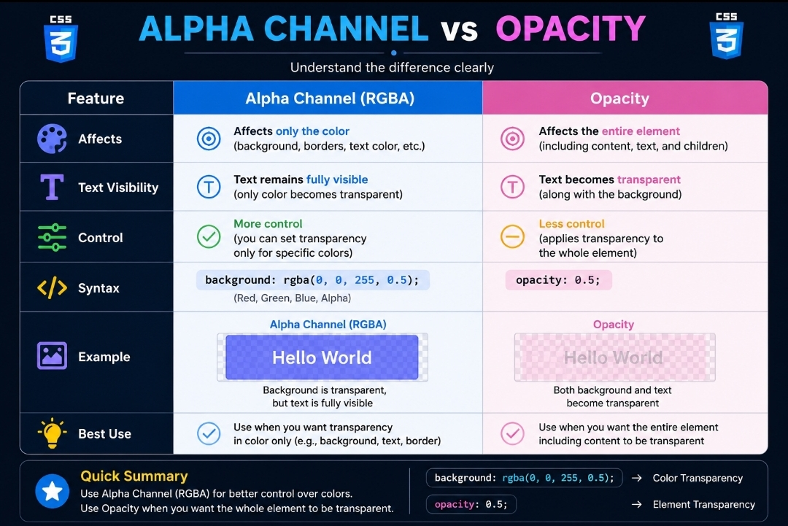

🎨 CSS Colors Notes

---

📖 What are CSS Colors?

CSS Colors are used to change the appearance of text, backgrounds, borders, and other elements on a webpage.

Colors help make websites:

✅ Attractive
✅ Readable
✅ User Friendly
✅ Visually Appealing

---

💻 Example

h1 {
color: blue;

}

The "color" property changes the text color of an element.

---

🎨 Foreground Color

Foreground Color refers to the color of text.

p {
color: red;

}

The text inside the paragraph will appear red.

⚠️ Foreground Color is controlled using the "color" property.

---

🖼️ Background Color

Background Color changes the background of an element.

div {
background-color: lightyellow;

}

The background of the div becomes light yellow.

⚠️ Background color does not affect text color.

---

#️⃣ HEX Colors

HEX Colors use hexadecimal values to represent colors.

p {
color: #ee3e80;

}

"#ee3e80" represents a pink color.

⚠️ HEX values always start with "#".

---

🔴🟢🔵 RGB Colors

RGB stands for:

- Red
- Green
- Blue

Each value ranges from 0 to 255.

p {
color: rgb(255, 0, 0);

}

This creates a red color.

---

🎨 RGB Color Examples

🔴 rgb(255, 0, 0) = Red

🟢 rgb(0, 255, 0) = Green

🔵 rgb(0, 0, 255) = Blue

---

🌈 RGBA Colors

RGBA stands for:

- Red
- Green
- Blue
- Alpha

Alpha controls transparency.

p {
color: rgba(255, 0, 0, 0.5);

}

The text becomes red with 50% transparency.

⚠️ Alpha values range from:

- 0 = Fully Transparent
- 1 = Fully Visible

---

🖼️ CSS Color Systems

"CSS Colors" (Resources/images/css-colors.jpeg)

This diagram shows HEX, RGB, and RGBA color systems.

---

👻 Opacity

Opacity controls the transparency of the entire element.

.box {
opacity: 0.5;

}

The whole element becomes 50% transparent.

Opacity affects:

- Text
- Background
- Border
- Images

Everything inside the element.

---

🎯 Alpha Channel

Alpha Channel controls transparency of a specific color.

background-color: rgba(0, 128, 0, 0.5);

Only the background color becomes transparent.

⚠️ Alpha Channel affects only the color where it is applied.

---

⚔️ Alpha vs Opacity

This comparison shows the difference between Alpha Channel and Opacity.

---

🔗 Inherit Property

The "inherit" value allows a child element to inherit a property from its parent.

.parent {
border: 2px solid green;

}

.child {
border: inherit;

}

The child element receives the same border as its parent.

⚠️ Inheritance helps maintain consistent styling.

---

🎓 Topics Covered

✅ Foreground Color
✅ Background Color
✅ HEX Colors
✅ RGB Colors
✅ RGBA Colors
✅ Opacity
✅ Alpha Channel
✅ Alpha vs Opacity
✅ Inherit Property

---

🚀 Final Summary

CSS Colors play an important role in modern web design.

Understanding color systems, transparency, and inheritance helps developers create beautiful, readable, and professional user interfaces.

Mastering CSS Colors is essential before learning:

- Background Images
- CSS Effects
- Flexbox
- UI Design
- Responsive Web Design
