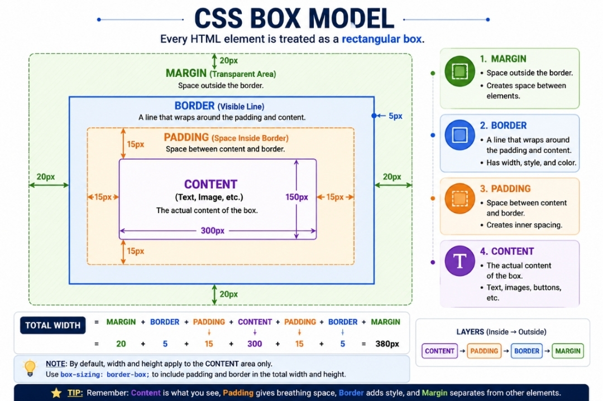

## 📘 CSS Box Model Notes

---

# 📌 What is CSS Box Model?

The CSS Box Model describes how every HTML element is treated as a rectangular box.

It consists of:

- Content
- Padding
- Border
- Margin

---

# ❓ Why Do We Use Box Model?

- Control spacing
- Create layouts
- Add borders
- Adjust element size
- Design cards and sections

---

# 🖼️ CSS Box Model Diagram

This diagram shows the relationship between Content, Padding, Border, and Margin.

---

# 📌 Parts of Box Model

Content

The actual text or image inside the element.

Padding

Space between content and border.

Border

The line around the content and padding.

Margin

Space outside the border.

---

# 💻 Example

div {
width: 200px;
padding: 20px;
border: 2px solid blue;
margin: 30px;
}

---

# 🔍 Explanation

- width = content width
- padding = inside spacing
- border = surrounding line
- margin = outside spacing

---

# 📝 Width and Height

div {
width: 250px;
height: 150px;
}

Width controls horizontal size.

Height controls vertical size.

---

# 📝 Border Properties

border: 2px solid blue;

Components:

- Border Width
- Border Style
- Border Color

---

# 📝 Padding Properties

padding: 20px;

Individual sides:

padding-top
padding-right
padding-bottom
padding-left

---

📝 Margin Properties

margin: 20px;

Individual sides:

margin-top
margin-right
margin-bottom
margin-left

---

# 📝 Border Radius

border-radius: 20px;

Used to create rounded corners.

---

# 📝 box-sizing Property

box-sizing: border-box;

This includes padding and border inside the width and height.

---

# ⚠️ Important Notes

- Every HTML element follows the Box Model.
- Padding creates inner spacing.
- Margin creates outer spacing.
- Border surrounds the content.
- box-sizing makes layouts easier.

---

# 🌍 Real World Usage

Box Model is used in:

- Cards
- Buttons
- Navigation Bars
- Forms
- Dashboards
- Product Cards

---

# 🚀 Practice Project

SMIT Student ID Card

Applied concepts:

- Width
- Height
- Border
- Padding
- Margin
- Border Radius
- Box Model

---

# ✅ Topics Covered

- Content Area
- Width & Height
- Border Properties
- Padding Properties
- Margin Properties
- Border Radius
- Box Model
